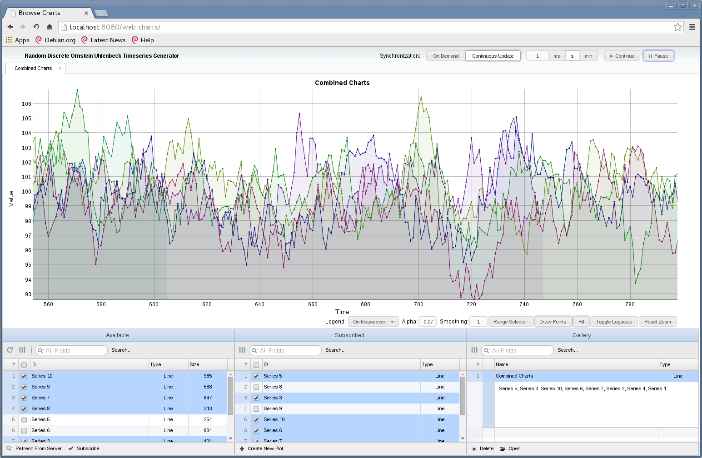
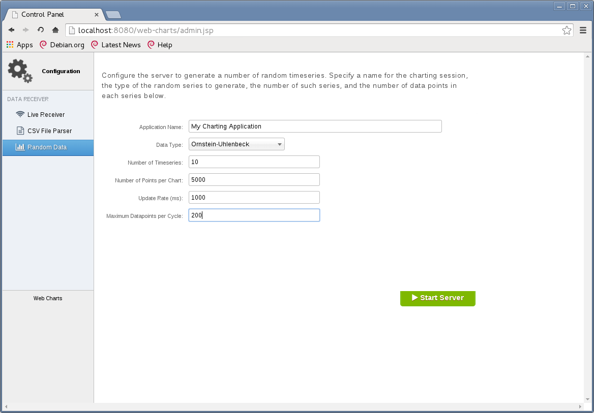

# web-charts

Interactive web charts. web-charts is web application that provides interactive on-demand 
scientific graphs in a web browser. The server may be generating the underlying data continuously,
or reading the data from eg. a database/CSV file source.

# Work in Progress

web-charts is incomplete and is a work in progress.

# License

The web-charts software is released under the GNU General Public License, Version 3, 29 June 2007. 
Documentation included with the web-charts software (eg. /doc/) is licensed under the GNU Free Documentation License, Version 1.3, 3 November 2008.

# Dependencies

web-charts uses external javascript libraries. These libraries are mostly in the /external/ subfolder.

web-charts uses:

 * the [Dygraphs](http://dygraphs.com) javascript charting library, which is licensed under the MIT license. The Dygraphs license text has been copied under /WebContent/external/dygraphs/dygraph-combined.LICENSE.
 * the [jQuery](http://jquery.com) javascript library (version 1.11.2), which is licensed uner the MIT license. The jQuery license text has been copied under /WebContent/external/jquery-1.11.2/jquery-1.11.2.LICENSE. 
 * the [jQuery UI](http://jqueryui.com) javascript library (version 1.11.3), which is licensed under the MIT license. The jQuery UI license text has been copied under /WebContent/external/jquery-ui-1.11.3/jquery-ui.LICENSE. Some images in the jQuery UI /images/ subfolder are modified.
 * the [w2ui](http://w2ui.com) javascript charting library (version 1.4.2), which is licensed under the MIT license. The w2ui version 1.4.2 license text has been copied under /WebContent/external/w2ui-1.4.2/w2ui-1.4.2.LICENSE. Some content in the w2ui folder is modified. 
 * the [font awesome](http://fortawesome.github.io/Font-Awesome/) font and CSS toolkit (version 4.3.0), whose license details are under /WebContent/external/font-awesome-4.3.0/font-awesome-4.3.0.LICENSE.
 